# HIPAA-Compliant Health Data Platform Architecture

## High-Level Architecture

```mermaid
graph TB
    subgraph "Client Layer"
        Users("🏥 Healthcare Users")
        Devices("📱 Mobile/Web Apps")
    end

    subgraph "Edge Security Layer"
        WAF("🛡️ AWS WAF")
        DDoS("⚡ AWS Shield")
    end

    subgraph "Identity & Access Layer"
        Cognito("🔐 Amazon Cognito<br/>OAuth2/MFA")
        Groups("👥 User Groups:<br/>Patient/Clinician/Admin")
    end

    subgraph "Application Layer"
        API("🌐 API Gateway")
        ALB("⚖️ Application Load Balancer")
        EKS("☸️ Amazon EKS<br/>Private Cluster")
        Pods("📦 Application Pods")
    end

    subgraph "Data Layer"
        RDS("🗄️ Amazon RDS<br/>PostgreSQL, KMS Encrypted")
        S3PHI("📂 S3 Bucket<br/>PHI Storage, Object Lock")
        Secrets("🔑 Secrets Manager")
    end

    subgraph "Security & Compliance Layer"
        CloudTrail("🔍 CloudTrail<br/>API Logging")
        GuardDuty("🚨 GuardDuty<br/>Threat Detection")
        SecurityHub("📋 Security Hub<br/>Centralized Findings")
        Config("⚙️ Config<br/>Resource Inventory")
    end

    subgraph "Observability Layer"
        CloudWatch("📊 CloudWatch<br/>Metrics & Logs")
        AMP("📈 Amazon Managed Prometheus")
        Grafana("📉 Grafana<br/>Dashboards")
        XRay("🔍 X-Ray<br/>Distributed Tracing")
    end

    subgraph "Networking Layer"
        VPC("🌐 VPC<br/>Private Subnets")
        Endpoints("🔌 VPC Endpoints<br/>S3, STS, KMS")
        TGW("🔄 Transit Gateway")
    end

    subgraph "Backup & DR Layer"
        Backup("💾 AWS Backup<br/>Automated Backups")
        CRR("🔄 Cross-Region Replication")
        DR("🏢 DR Site<br/>Secondary Region")
    end

    %% Connections
    Users --> WAF
    Devices --> WAF
    WAF --> API
    API --> ALB
    ALB --> EKS
    EKS --> Pods
    Cognito --> API
    EKS --> RDS
    EKS --> S3PHI
    EKS --> Secrets
    VPC <--> EKS
    VPC <--> RDS
    VPC <--> S3PHI
    CloudTrail -.-> VPC
    CloudTrail -.-> EKS
    CloudTrail -.-> RDS
    CloudTrail -.-> S3PHI
    GuardDuty -.-> VPC
    GuardDuty -.-> EKS
    SecurityHub -.-> GuardDuty
    Config -.-> AllResources
    CloudWatch -.-> EKS
    CloudWatch -.-> RDS
    CloudWatch -.-> S3PHI
    XRay -.-> EKS
    Backup -.-> RDS
    Backup -.-> S3PHI
    CRR --> DR
    Endpoints --> AWS_Services

    style VPC fill:#e1f5fe
    style EKS fill:#f3e5f5
    style RDS fill:#e8f5e8
    style S3PHI fill:#fff3e0
    style Cognito fill:#fce4ec
```



## Network Architecture

```mermaid
graph LR
    subgraph "AWS Account Structure"
        Org("🏢 AWS Organization")
        Security("🔒 Security Account")
        Shared("🔗 Shared Services")
        Prod("🏭 Production Account")
    end

    subgraph "Production VPC"
        Public("☁️ VPC - No Public Subnets")
        Private1("🔒 Private Subnet AZ1")
        Private2("🔒 Private Subnet AZ2")
        Private3("🔒 Private Subnet AZ3")
    end

    subgraph "VPC Endpoints"
        EP_S3("📦 S3 Gateway Endpoint")
        EP_STS("🔑 STS Interface Endpoint")
        EP_KMS("🔑 KMS Interface Endpoint")
        EP_ECR("🐳 ECR Interface Endpoint")
        EP_EKS("☸️ EKS Interface Endpoint")
    end

    Org --> Security
    Org --> Shared
    Org --> Prod
    Public --> Private1
    Public --> Private2
    Public --> Private3
    Public --> EP_S3
    Private1 --> EP_STS
    Private2 --> EP_KMS
    Private3 --> EP_ECR
    Private1 --> EP_EKS

    style Public fill:#ffebee
    style Private1 fill:#e8f5e8
    style Private2 fill:#e8f5e8
    style Private3 fill:#e8f5e8
```



## Security Architecture

```mermaid
graph TD
    subgraph "Zero Trust Security Model"
        IdP("🆔 Identity Provider")
        MFA("🛡️ MFA Enforcement")
        RBAC("👥 Role-Based Access Control")
        ZTNA("🔒 Zero Trust Network Access")
    end

    subgraph "Encryption Layer"
        TLS("_TLS 1.2+ in Transit")
        KMS("🔑 AWS KMS CMKs")
        SSE("🔒 Server-Side Encryption")
        ClientEnc("📤 Client-Side Encryption")
    end

    subgraph "Audit & Compliance"
        ImmutableLog("📝 Immutable Audit Logs")
        ObjectLock("🔒 S3 Object Lock")
        Retention("⏱️ Retention Policies")
        ComplianceCheck("✅ Compliance Validation")
    end

    IdP --> MFA
    MFA --> RBAC
    RBAC --> ZTNA
    TLS <--> KMS
    KMS --> SSE
    ClientEnc --> TLS
    ImmutableLog --> ObjectLock
    ObjectLock --> Retention
    Retention --> ComplianceCheck

    style IdP fill:#e3f2fd
    style KMS fill:#fff3e0
    style ImmutableLog fill:#f3e5f5
```



## Data Flow Architecture

```mermaid
sequenceDiagram
    participant U as Healthcare User
    participant C as Cognito
    participant A as API Gateway
    participant E as EKS
    participant R as RDS
    participant S as S3 PHI

    U->>+C: Authenticate (MFA)
    C-->>-U: Auth Token
    U->>+A: Request with Token
    A->>+E: Forward Request
    alt PHI Data Request
        E->>+S: Query PHI Data
        S-->>-E: Return PHI Data
        E-->>-U: Response
    else Clinical Data Request
        E->>+R: Query Clinical Data
        R-->>-E: Return Data
        E-->>-U: Response
    end
```

## Compliance Architecture

```mermaid
graph BT
    subgraph "HIPAA Compliance Framework"
        Admin("📋 Administrative Safeguards")
        Phys("🏗️ Physical Safeguards")
        Tech("💻 Technical Safeguards")
    end

    subgraph "Implemented Controls"
        BA("🤝 Business Associate Agreements")
        Training("🎓 Staff Training")
        Access("🔐 Access Management")
        Audit("📝 Audit Controls")
        Integrity("✅ Data Integrity")
        Transmission("📤 Transmission Security")
    end

    Admin --> BA
    Admin --> Training
    Tech --> Access
    Tech --> Audit
    Tech --> Integrity
    Tech --> Transmission

    style Admin fill:#e8f5e8
    style Phys fill:#e3f2fd
    style Tech fill:#fff3e0
```

